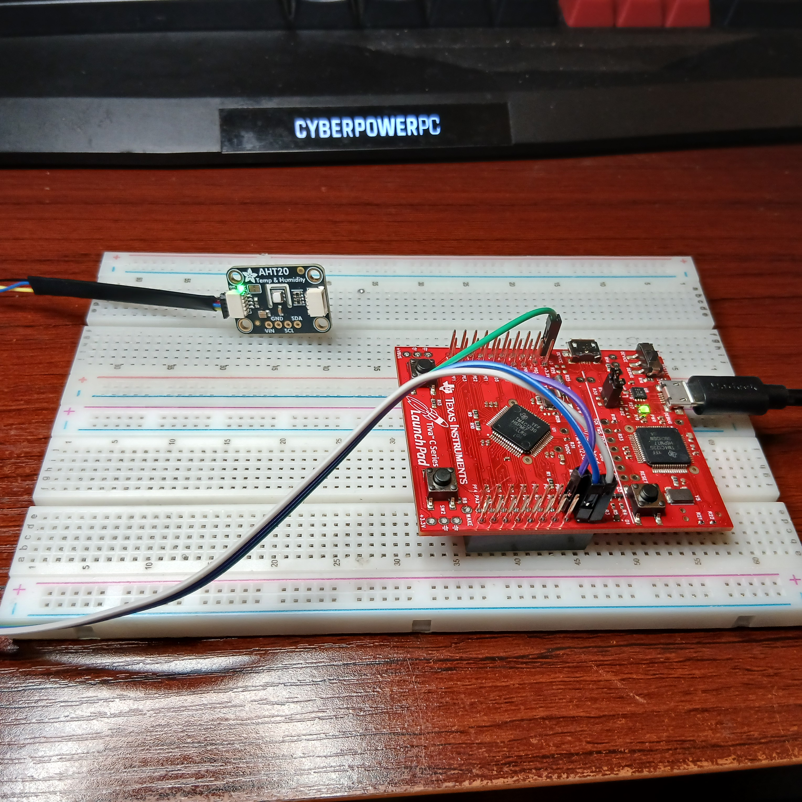
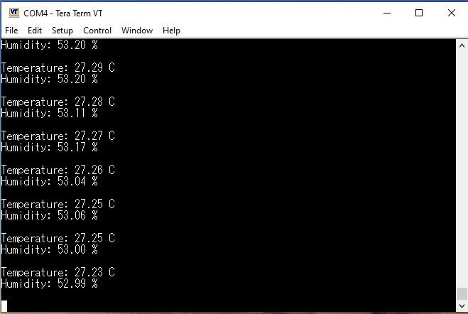
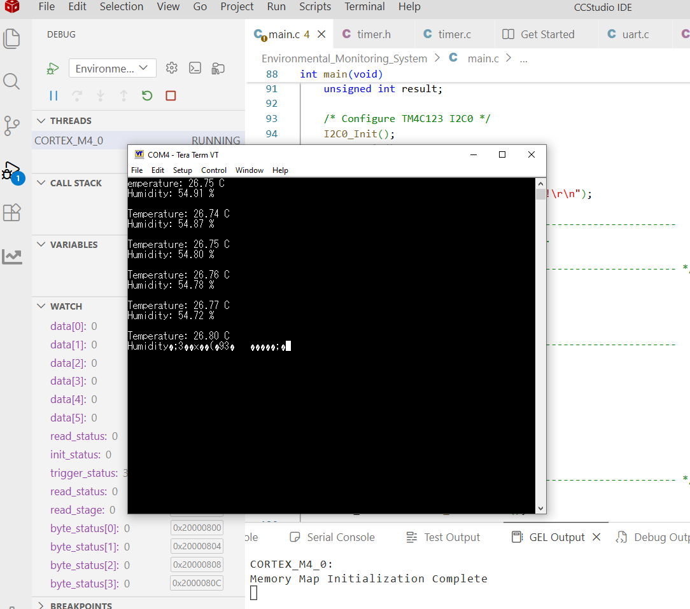

# TM4C123 Environmental Monitoring System

A register-level embedded environmental monitoring system built on the **Texas Instruments TM4C123GH6PM ARM Cortex-M4 microcontroller**.

The system interfaces with an **AHT20 temperature and humidity sensor over I²C**, processes the sensor's raw 20-bit measurement data, and transmits real-time environmental readings to a PC through **UART serial communication**.

Rather than relying on high-level peripheral libraries, the core peripheral drivers were implemented using **direct register-level Embedded C**, providing hands-on experience with ARM Cortex-M4 peripherals, memory-mapped I/O, communication protocols, hardware timing, and embedded debugging.

---
## Working Prototype



**Working hardware prototype:** TM4C123GXL LaunchPad interfaced with an AHT20 temperature and humidity sensor over I²C.

## Project Highlights

- Register-level Embedded C development
- ARM Cortex-M4 microcontroller programming
- Custom I²C peripheral configuration
- Multi-byte I²C sensor transactions
- AHT20 temperature and humidity sensor integration
- Raw 20-bit sensor data decoding and conversion
- UART serial communication at 115200 baud
- Timer0A-based periodic sampling
- I²C timeout and error handling
- GPIO alternate-function configuration
- Open-drain SDA configuration
- Hardware-level debugging using Code Composer Studio
- Real-time serial monitoring using Tera Term

---

## System Architecture

```text
             +------------------+
             |      AHT20       |
             | Temp / Humidity  |
             +--------+---------+
                      |
                      | I2C
                      | SDA / SCL
                      |
             +--------v---------+
             |    TM4C123GXL    |
             |  TM4C123GH6PM    |
             |   Cortex-M4      |
             +--------+---------+
                      |
          +-----------+-----------+
          |                       |
       Timer0A                  UART0
    Periodic Timing          115200 baud
                                  |
                                  |
                         Stellaris Debug USB
                                  |
                                  v
                         +----------------+
                         |       PC       |
                         |   Tera Term    |
                         +----------------+
```

---

## Hardware

| Component | Purpose |
|---|---|
| TI TM4C123G LaunchPad | Main embedded controller |
| TM4C123GH6PM | ARM Cortex-M4 microcontroller |
| AHT20 | Digital temperature/humidity sensor |
| USB Debug Interface | Programming, debugging, and UART connection |
| PC | Serial monitoring and development |

---

## Communication Interfaces

### I²C — AHT20 Sensor

The AHT20 communicates with the TM4C123 using the **I²C protocol**.

The I²C0 peripheral is configured directly through TM4C123 hardware registers.

| Signal | TM4C123 Pin | Function |
|---|---|---|
| SCL | PB2 | I2C0SCL |
| SDA | PB3 | I2C0SDA |
| VCC | 3.3 V | Sensor power |
| GND | GND | Ground |

The implementation includes:

- I²C0 peripheral clock configuration
- GPIO alternate-function configuration
- GPIO port-control configuration
- SDA open-drain configuration
- 100 kHz I²C timing configuration
- START and STOP generation
- ACK/NACK handling
- Multi-byte reads
- Device addressing
- Timeout detection
- Bus error checking

---

## UART — PC Telemetry

UART0 sends processed environmental measurements from the TM4C123 to a PC.

| Parameter | Configuration |
|---|---|
| UART Peripheral | UART0 |
| RX | PA0 |
| TX | PA1 |
| Baud Rate | 115200 |
| Data Bits | 8 |
| Parity | None |
| Stop Bits | 1 |
| Interface | Stellaris Virtual Serial Port |

The LaunchPad's onboard debug interface allows UART data to reach the PC over USB without requiring an external USB-to-UART converter.

Example serial output:

```text
Temperature: 26.28 C
Humidity: 51.18 %

Temperature: 26.31 C
Humidity: 51.24 %

Temperature: 26.29 C
Humidity: 51.20 %
```

### Live Sensor Output



**Real-time UART telemetry:** Temperature and relative humidity measurements acquired from the AHT20 and transmitted by the TM4C123 to a PC at 115200 baud.
---

## Timer0A

The project uses the TM4C123 **General-Purpose Timer Module (GPTM)** to provide periodic measurement timing.

Timer0A is configured as a **32-bit periodic timer**.

With a 16 MHz system clock:

```text
16,000,000 clock cycles ≈ 1 second
```

The timer reload value is therefore configured as:

```c
TIMER0_TAILR_R = 15999999U;
```

The current implementation uses **polling** of the Timer0A timeout status flag to control periodic sampling.

---

## AHT20 Data Processing

The AHT20 returns temperature and humidity measurements as packed multi-byte data.

The firmware reconstructs the **20-bit humidity measurement** using:

```c
raw_humidity =
    ((unsigned int)buffer[1] << 12) |
    ((unsigned int)buffer[2] << 4)  |
    ((unsigned int)buffer[3] >> 4);
```

Relative humidity is calculated using:

```text
Humidity (%) = Raw Humidity × 100 / 2^20
```

The **20-bit temperature measurement** is reconstructed using:

```c
raw_temperature =
    (((unsigned int)buffer[3] & 0x0F) << 16) |
    ((unsigned int)buffer[4] << 8)           |
    (unsigned int)buffer[5];
```

Temperature is then calculated using:

```text
Temperature (°C) = Raw Temperature × 200 / 2^20 - 50
```

This portion of the project demonstrates multi-byte data handling, bit masking, bit shifting, integer representation, and floating-point conversion in an embedded environment.

---

## Register-Level Programming

One of the primary goals of this project was to understand what occurs beneath high-level microcontroller libraries.

Peripheral configuration is therefore performed directly through memory-mapped registers.

For example:

```c
SYSCTL_RCGCI2C_R |= 0x01U;
```

enables the I²C0 peripheral clock.

At the hardware level, this corresponds to accessing a memory-mapped peripheral register and modifying the required control bit.

The project applies this approach to:

- System Control
- GPIO
- I²C
- UART
- General-Purpose Timer

This provided practical experience working directly with microcontroller datasheets, register maps, bit fields, peripheral configuration sequences, and hardware status flags.

---

## Software Structure

```text
TM4C123-Environmental-Monitoring-System/
│
├── main.c
│   ├── Application control
│   ├── AHT20 initialization
│   ├── Measurement triggering
│   ├── Sensor data acquisition
│   └── Data conversion
│
├── uart.c
│   ├── UART0 initialization
│   ├── Character transmission
│   ├── String transmission
│   └── Floating-point output
│
├── uart.h
│
├── timer.c
│   ├── Timer0A initialization
│   └── Periodic timing
│
├── timer.h
│
├── startup_ccs.c
│
├── tm4c123gh6pm.cmd
│
└── targetConfigs/
```

---

## Embedded Concepts Demonstrated

This project demonstrates practical experience with:

**Microcontroller Architecture**
- ARM Cortex-M4
- Memory-mapped peripherals
- Peripheral clock gating
- Hardware register manipulation

**Digital Communication**
- I²C
- UART
- Serial sensor communication
- Multi-byte transactions

**Low-Level C**
- Bitwise operations
- Bit masking
- Bit shifting
- Pointer/register concepts
- Integer and floating-point data conversion
- Modular firmware organization

**Timing**
- Hardware timers
- Periodic timer configuration
- Status-flag polling

**Embedded Debugging**
- Peripheral register inspection
- Communication status monitoring
- Timeout handling
- Hardware/software integration debugging
- Serial output verification

---

## Development Environment

- **Microcontroller:** TM4C123GH6PM
- **Development Board:** EK-TM4C123GXL LaunchPad
- **Architecture:** ARM Cortex-M4
- **Language:** Embedded C
- **IDE:** Texas Instruments Code Composer Studio
- **Compiler:** TI Clang
- **Sensor:** AHT20
- **Serial Terminal:** Tera Term
- **Version Control:** Git / GitHub

---
### Development and Hardware Debugging



**Firmware development and testing:** Code Composer Studio running the TM4C123 firmware while live sensor measurements are monitored through the UART serial interface.

## Engineering Challenges Addressed

Developing the project required debugging issues beyond simply obtaining sensor readings.

Some of the challenges addressed included:

- Configuring I²C entirely at the register level
- Correctly routing GPIO pins to peripheral alternate functions
- Configuring SDA for open-drain operation
- Implementing reliable multi-byte I²C transactions
- Correctly sequencing START, RUN, ACK/NACK, and STOP operations
- Detecting peripheral completion using hardware status flags
- Implementing timeout protection to prevent firmware from remaining indefinitely in communication loops
- Reconstructing packed 20-bit sensor measurements
- Configuring UART baud-rate registers for a 16 MHz clock
- Integrating multiple independent peripherals into one embedded application
- Replacing software timing delays with a hardware timer for periodic sampling

These challenges provided practical experience debugging interactions between **firmware, microcontroller peripherals, communication protocols, and physical hardware**.

---

## Current System Flow

```text
Initialize MCU peripherals
        |
        v
Initialize I2C0
        |
        v
Initialize UART0
        |
        v
Initialize Timer0A
        |
        v
Initialize AHT20
        |
        v
Trigger Measurement
        |
        v
Wait for AHT20
        |
        v
Read Sensor Status
        |
        v
Read 6 Data Bytes
        |
        v
Decode 20-bit Measurements
        |
        v
Calculate Temperature & Humidity
        |
        v
Transmit Results over UART
        |
        v
Wait for Timer0A
        |
        +----------> Repeat
```

---

## Future Improvements

Planned extensions include:

- Timer-driven interrupt-based sampling
- Interrupt-driven UART
- I²C OLED display integration
- Environmental threshold alarms
- GPIO status indicators
- User-input controls
- Improved sensor fault detection
- Data logging
- Refactoring selected drivers using TivaWare for comparison with the register-level implementation
- Potential RTOS-based task scheduling

---

## What I Learned

This project strengthened my understanding of how embedded software interacts directly with hardware.

Instead of treating I²C, UART, GPIO, and timers as abstract library calls, I implemented and debugged their configuration at the register level. This required understanding peripheral clocking, GPIO multiplexing, hardware register maps, status flags, communication sequencing, timing, and sensor data representation.

The project also reinforced an important embedded-systems principle:

> Reliable embedded development requires understanding both the software and the hardware behavior underneath it.

---

## Author

**Babatope Ayeni**

Computer Science graduate pursuing graduate study in Computer Engineering, with interests in embedded systems, ARM microcontrollers, firmware development, sensor interfaces, and biomedical/medical-device technology.